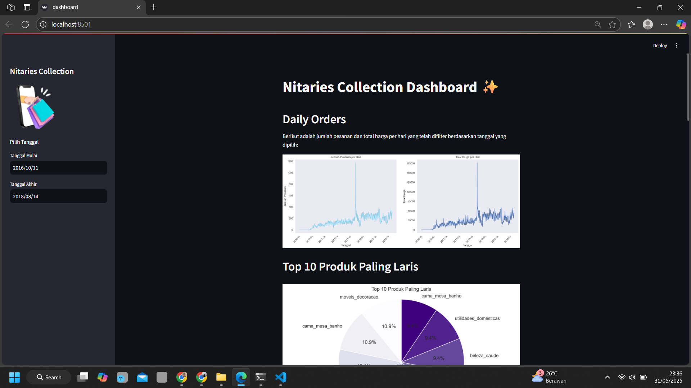

# 📊 Nitaries Collection Dashboard

<p align="center">
  
  
  
  
  
</p>

> Dashboard interaktif berbasis **Streamlit** untuk menganalisis data pelanggan dan pesanan dari koleksi Nitaries.

---

## 🖼️ Preview

<p align="center">
  
</p>

---

## 🚀 Fitur Utama

✨ Dashboard ini menyediakan:

- 📈 Visualisasi tren penjualan & jumlah pelanggan
- 🕒 Analisis performa berdasarkan waktu
- 🛍️ Statistik berdasarkan kategori produk
- 📊 Grafik interaktif dan tabel informatif

---

## 🧰 Teknologi yang Digunakan

| Teknologi     | Deskripsi                           |
| ------------- | ----------------------------------- |
| 🧪 Streamlit  | Framework dashboard berbasis Python |
| 📊 Pandas     | Manipulasi dan pembersihan data     |
| 📈 Seaborn    | Visualisasi statistik               |
| 📉 Matplotlib | Visualisasi data klasik             |
| 🔢 NumPy      | Operasi numerik                     |

---

## 📦 Prasyarat

- 🐍 Python **3.8** (direkomendasikan)
- 🧪 Anaconda / Miniconda atau `virtualenv`
- 🧰 Git

---

## ⚙️ Instalasi & Menjalankan

### 🔁 1. Clone Repository

```bash
git clone https://github.com/Nitaa1904/Nitaa1904-DashboardE-Commerce.git
cd Nitaa1904-DashboardE-Commerce
```

### 🛠️ 2. Buat dan Aktifkan Environment

Dengan Conda:

```bash
conda create --name main-ds python=3.8
conda activate main-ds
```

Dengan venv:

```bash
python -m venv myenv
myenv\Scripts\activate
```

### 📦 3. Install Dependensi

Dengan file `requirements.txt`:

```bash
pip install -r requirements.txt
```

Atau install manual:

```bash
pip install streamlit pandas numpy matplotlib seaborn
```

---

## ▶️ Jalankan Aplikasi

```bash
streamlit run dashboard.py
```

🔗 Akses di browser:
`http://localhost:8501`

---

## 📁 Struktur Folder

```plaintext
📦 Proyek Analisis Data/
├── dashboard.py              # File utama aplikasi Streamlit
├── all_data.csv             # Dataset utama
├── requirements.txt         # Daftar dependensi
├── README.md                # Dokumentasi proyek
├── url.txt                  # Data tambahan
├── 2-removebg-preview.png   # Gambar awal preview (tidak wajib)
└── venv/, main-ds/, myenv/  # Folder environment (abaikan di repo)
```

> 🧼 **Tips**: Tambahkan `venv/`, `main-ds/`, atau `myenv/` ke file `.gitignore`.


---

## ✅ Unit Testing dengan Pytest
Install pytest jika belum:

```bash
pip install pytest
```

Jalankan perintah berikut untuk mengeksekusi semua test yang ada:

```bash
pytest
```

---
## ✅ Type Checking dengan Mypy

Install mypy dan tipe stub yang diperlukan:

```bash
pip install mypy pandas-stubs types-seaborn
```

Jalankan pemeriksaan tipe dengan perintah:

```bash
mypy dashboard.py --ignore-missing-imports
```
Gunakan opsi --ignore-missing-imports untuk menghindari error dari modul yang belum memiliki stub tipe.


---


## 📝 Catatan

- Cocok untuk pembelajaran data analysis dan portfolio.
- Gunakan browser modern (Chrome, Firefox) untuk pengalaman terbaik.
- Saat selesai, jalankan `deactivate` untuk keluar dari environment.

---

## 🙋‍♀️ Tentang Pengembang

**👩‍💻 Nita Fitrotul Mar'ah**
🎓 Telkom University
🔗 [LinkedIn](https://linkedin.com/in/nitafitrotul)
📧 [nitafitrotul1904@gmail.com](mailto:nitafitrotul1904@gmail.com)

---

<p align="center">
  Dibuat dengan ❤️ oleh Nita · 2025
</p>
